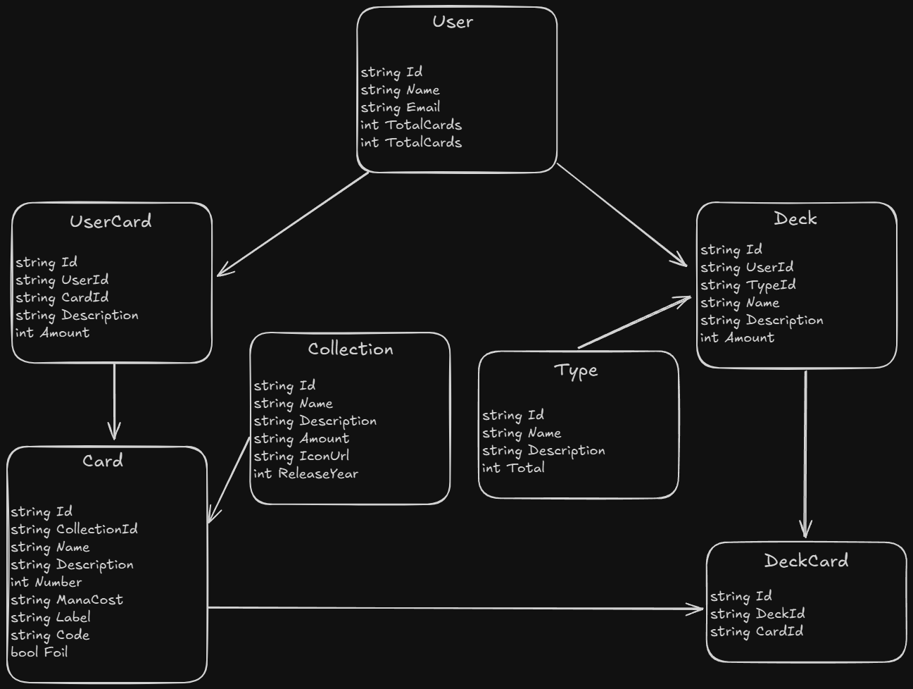

## Database Structure

 
 ## Packages

### Swagger:
```sh
dotnet add package Swashbuckle.AspNetCore --version 8.1.1

Microsoft.AspNetCore.OpenApi
Microsoft.EntityFrameworkCore
Microsoft.EntityFrameworkCore.Tools
Pomelo.EntityFrameworkCore.MySql
Swashbuckle.AspNetCore
xunit
DotNetEnv


Install-Package Microsoft.AspNetCore.OData

```

<hr />

## Project Structure

```txt
/Deck_Manager
│
│
├── /Api                            # Main project (presentation layer - Controllers)
│   │
│   ├── Controllers/                # API controllers
│   ├── Middlewares/                # Custom middlewares
│   ├── Program.cs                  # Application entry point (since .NET 6+)
│   ├── appsettings.json            # Application settings
│   │
│   └── Properties/
│       └── launchSettings.json
│
├── /Application                    # Application layer (business logic and services)
│   │
│   ├── Interfaces/                 # Service interfaces
│   └── Services/                   # Service implementations
│
├── /Domain                         # Domain layer (pure domain entities and rules)
│   │
│   ├── Entities/                   # Domain entities
│   └── ValueObjects/               # Value Objects (if any)
│
├── /Infrastructure                 # Infrastructure layer (data access, external integrations)
│   │
│   ├── Data/                       # DbContext and repositories
│   ├── Migrations/                 # EF Core migrations
│   └── Configurations/             # Entity configurations (Fluent API)
│
├── /Tests                          # Test project
│   │
│   ├── Unit/                       # Unit tests
│   └── Integration/                # Integration tests
│
└── /Shared                         # (Optional) Shared classes across projects
    │
    ├── DTOs/                       # Data Transfer Objects
    ├── Constants/                  # Globally used constants
    └── Exceptions/                 # Custom exception classes
```

<hr />

## Migration and Update Table

### Migrate
```ssh
Add-Migration migrationName
or
Add-Migration migrationName -OutputDir Infrastructure\Migrations -Verbose
```

### Update
```ssh
Update-Database
```

<hr />

## OData

### Filter
```
/odata/Cards?$filter=Name eq 'Pikachu'
```

### Pagination (top or skip)
```
/odata/Cards?$top=10
/odata/Cards?$skip=5&$top=10
```

### Select
```
/odata/Cards?$select=Id
/odata/Cards?$select=Id,Name
```

### Count
```
/odata/Cards/$count
```
or
```
/odata/Cards?$count=true
```

## Extra

### Expands (only when there is navigation between entities)
```
/odata/$metadata
```

### See EDM (Entity Data Model)
```
/odata/$metadata
```

### List all EntitySets possible
```
/odata
```